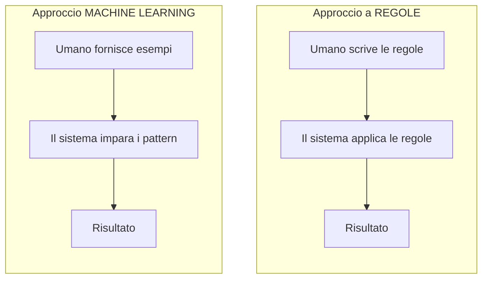
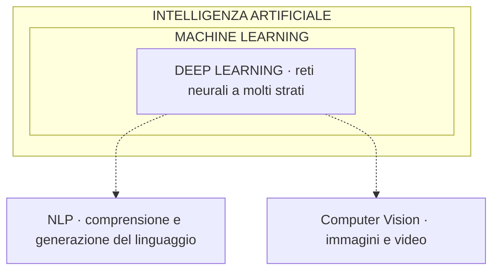

# Intelligenza Artificiale: storia, definizioni e rami principali

> 📌 **In breve** · ⏱ ~50 min · 🎯 Saprai dire cos’è (e cosa NON è) l’intelligenza artificiale.
> Una mappa onesta del territorio: niente magia né coscienza. Distingui AI, machine learning e deep learning, e capisci dove siamo davvero.

In questo capitolo costruiremo una mappa del territorio dell'intelligenza artificiale: sobria, onesta, e resistente alle esagerazioni che si leggono ogni giorno. Prima di usare questi sistemi con competenza reale, è necessario capire cosa sono davvero — e cosa non sono.

## Introduzione

Chiudiamo il Capitolo 1 avendo capito come due programmi si parlano attraverso un'API. Ora dobbiamo iniziare a capire cosa c'è, esattamente, dall'altra parte di una chiamata API a un servizio come Claude o ChatGPT. La risposta a questa domanda richiede di partire da molto lontano, perché la parola "intelligenza artificiale" viene usata oggi per descrivere cose profondamente diverse tra loro — e questa confusione produce aspettative sbagliate, paure ingiustificate, ed errori di progettazione quando si costruiscono sistemi reali.

Questa lezione ha un obiettivo preciso: darti una mappa del territorio, sobria e onesta, prima di addentrarci nei dettagli tecnici. Senza questa mappa, rischi di confondere "AI" con "ChatGPT", oppure di credere che un chatbot moderno sia concettualmente vicino a un'intelligenza generale paragonabile alla nostra. Nessuna delle due cose è vera, e capire perché è il primo passo per usare questi sistemi con competenza reale.

---

## Obiettivi di Apprendimento

Al termine di questa lezione sarai in grado di:

- Dare una definizione operativa di intelligenza artificiale, priva di misticismo
- Distinguere l'AI a regole esplicite dal Machine Learning
- Posizionare correttamente Machine Learning, Deep Learning, NLP e Computer Vision l'uno rispetto all'altro
- Spiegare la differenza tra AI ristretta e AI generale, e collocare onestamente lo stato dell'arte attuale

---

## 1. Cos'è l'intelligenza artificiale — una definizione operativa

Definire "intelligenza artificiale" in modo filosoficamente rigoroso è un problema che divide ricercatori e filosofi da decenni, e non lo risolveremo qui. Ci serve invece una **definizione operativa**, utile a orientarci nel resto del corso:

> **Intelligenza Artificiale** è il campo dell'informatica che si occupa di costruire sistemi capaci di svolgere compiti che, se eseguiti da un essere umano, richiederebbero quella che chiamiamo "intelligenza" — riconoscere immagini, comprendere il linguaggio, prendere decisioni, pianificare azioni.

Nota cosa questa definizione **non dice**: non dice che il sistema "pensa", non dice che il sistema "capisce" nel senso in cui un umano capisce, non dice nulla sulla coscienza o sull'esperienza soggettiva. È una definizione basata sul comportamento osservabile (cosa il sistema riesce a fare), non sui meccanismi interni o su ipotetici stati mentali.

Questa cautela non è pignoleria accademica: è una protezione contro uno degli errori più comuni e più costosi nell'uso pratico dell'AI, che è attribuire comprensione, intenzionalità o coscienza a sistemi che, internamente, eseguono operazioni matematiche su numeri. Torneremo su questo punto con grande precisione quando arriveremo a parlare degli LLM nel Capitolo 4.

---

## 2. AI a regole esplicite vs Machine Learning: la grande biforcazione

Storicamente, esistono due approcci radicalmente diversi per costruire un sistema "intelligente". Capire questa biforcazione è essenziale per capire perché il Machine Learning ha "vinto" la corsa che ha portato agli LLM.

### L'approccio a regole esplicite (AI simbolica)

Nei primi decenni dell'informatica (anni '50–'80), il modo dominante di costruire un sistema intelligente era scrivere **regole esplicite**, decise da un programmatore umano:

```
SE temperatura > 38°C E tosse = vero
ALLORA probabilità_influenza = alta

SE pioggia = vero
ALLORA suggerisci_ombrello = vero
```

Questo approccio funziona bene per problemi ben definiti e limitati, ma si scontra con un muro evidente: il mondo reale è troppo complesso, ambiguo e pieno di eccezioni per essere descritto interamente con regole scritte a mano. Nessun programmatore può scrivere manualmente tutte le regole necessarie per, ad esempio, riconoscere un volto in una fotografia in qualsiasi condizione di luce, angolazione, espressione.

### L'approccio Machine Learning

Il **Machine Learning** rovescia il problema: invece di scrivere le regole, si forniscono al sistema moltissimi **esempi** (dati), e si lascia che il sistema **scopra da solo** i pattern che permettono di distinguere, classificare, prevedere.



Questa svolta — dal "programmare regole" al "fornire esempi e lasciare che il sistema impari" — è la base concettuale di tutta l'AI moderna, inclusi i modelli linguistici che useremo per costruire i nostri agenti. Approfondiremo esattamente come funziona questo "apprendere dai dati" nella prossima lezione.

---

## 3. I grandi rami dell'AI: una mappa di posizionamento

Il termine "Intelligenza Artificiale" è un cappello molto ampio, sotto il quale vivono discipline con scopi diversi. Vediamo come si posizionano l'una rispetto all'altra, perché capirlo evita confusioni terminologiche che altrimenti si trascinano per tutto il corso.



- **Machine Learning** è un sottoinsieme dell'AI: l'approccio "impara dai dati" descritto sopra
- **Deep Learning** è un sottoinsieme del Machine Learning: usa specificamente le **reti neurali artificiali**, strutture a più strati che vedremo in dettaglio nella Lezione 3.3
- **NLP** (Natural Language Processing) è l'area applicativa che si occupa di linguaggio: comprenderlo, generarlo, tradurlo. Oggi è dominata dal Deep Learning, ma esisteva (con risultati molto più limitati) anche prima
- **Computer Vision** è l'area applicativa che si occupa di immagini e video: riconoscimento di oggetti, volti, scene

I modelli linguistici di grandi dimensioni che studieremo nel Capitolo 4 — Claude, GPT, e simili — sono il punto di incontro tra Deep Learning e NLP: usano reti neurali profonde, applicate specificamente al linguaggio.

---

## 4. Cosa significa "addestrare" un modello — anteprima concettuale

Useremo spesso, da qui in avanti, il verbo "addestrare" (in inglese, *training*). Anticipiamo qui un'intuizione che approfondiremo nella prossima lezione: addestrare un modello significa esporlo a una grande quantità di esempi e, attraverso un processo matematico iterativo, aggiustare progressivamente i suoi parametri interni finché non diventa bravo a svolgere il compito per cui è stato esposto a quegli esempi.

> **Analogia concreta:** pensa a come impari a riconoscere se un frutto è maturo. Nessuno ti ha dato una formula matematica precisa basata sul colore esatto in nanometri di lunghezza d'onda. Hai visto centinaia di frutti, alcuni maturi e altri no, qualcuno ti ha corretto quando sbagliavi, e gradualmente il tuo cervello ha costruito un modello intuitivo. Il Machine Learning fa, con la matematica, qualcosa di analogo — su scala molto più ampia e con un processo molto più meccanico e privo di comprensione nel senso umano.

---

## 5. AI ristretta vs AI generale: dove siamo davvero

Una distinzione cruciale, spesso fonte di equivoci nella discussione pubblica sull'AI:

- **AI ristretta (Narrow AI)**: un sistema progettato e addestrato per svolgere un compito specifico, o un insieme limitato di compiti. Un sistema che gioca a scacchi a livello sovrumano non sa fare altro che giocare a scacchi. Un sistema che riconosce volti non sa guidare un'auto.
- **AI generale (AGI — Artificial General Intelligence)**: un sistema ipotetico capace di apprendere e svolgere *qualsiasi* compito intellettuale che un umano può svolgere, con la stessa flessibilità e capacità di adattamento a situazioni nuove e mai viste.

Ad oggi, **tutti i sistemi di AI esistenti, inclusi i modelli linguistici più avanzati come Claude o GPT, sono AI ristretta** — per quanto la loro ristrettezza sia diventata sorprendentemente ampia (un singolo modello linguistico può scrivere codice, tradurre lingue, riassumere testi, ragionare su problemi matematici). Questa ampiezza ha portato alcuni a parlare di "AI generale emergente", ma è una posizione dibattuta, non un fatto consolidato.

Per il nostro corso, la posizione corretta e onesta è: stiamo per imparare a costruire sistemi sofisticati, utili, capaci di automatizzare compiti complessi — ma stiamo lavorando con strumenti che hanno limiti precisi e prevedibili, non con un'intelligenza paragonabile alla nostra. Mantenere questa cornice mentale è ciò che, paradossalmente, ci permetterà di costruire sistemi più affidabili: progetteremo supervisione, controlli e correzioni proprio perché sappiamo che il sistema può sbagliare in modi specifici.

---

## Esempio Pratico: Riconoscere i Rami dell'AI nella Vita Quotidiana

Prova a classificare questi sistemi che probabilmente usi già, usando la mappa della Sezione 3:

| Sistema | Ramo principale | Perché |
|---|---|---|
| Filtro antispam della tua email | Machine Learning (classico) | Impara a distinguere spam da non-spam da esempi etichettati |
| Riconoscimento del tuo volto per sbloccare il telefono | Computer Vision (Deep Learning) | Interpreta un'immagine per identificare un pattern specifico |
| Traduzione automatica di una pagina web | NLP (Deep Learning) | Comprende e genera linguaggio in un'altra lingua |
| Suggerimenti di prossima parola mentre scrivi un messaggio | NLP (Deep Learning, versione semplificata) | Prevede testo basandosi su pattern linguistici |
| Un assistente come Claude che risponde a domande complesse | NLP + Deep Learning, su scala molto più ampia | Lo stesso principio dei precedenti, ma con architetture e scala radicalmente superiori (Capitolo 4) |

Questo esercizio di classificazione non è fine a se stesso: ti abitua a guardare un sistema AI e chiederti "che tipo di problema sta risolvendo, e con quale approccio?" — una domanda che farai costantemente quando progetterai agenti e dovrai scegliere quale strumento o modello usare per quale compito.

---

## Riepilogo

- L'**intelligenza artificiale** si definisce meglio in base al comportamento osservabile (cosa un sistema riesce a fare) che in base a ipotetici stati mentali interni.
- Storicamente si è passati dall'**AI a regole esplicite** (scritte da un programmatore) al **Machine Learning** (pattern scoperti dai dati): è la svolta che rende possibile tutta l'AI moderna.
- **Machine Learning ⊃ Deep Learning**, e **NLP** e **Computer Vision** sono aree applicative che oggi si appoggiano principalmente sul Deep Learning.
- Tutti i sistemi AI esistenti, inclusi i modelli linguistici più avanzati, sono **AI ristretta**: capace di compiti specifici, anche molto ampi, ma non equivalente a un'intelligenza generale.

---

## Domande di Verifica

1. Un sistema che calcola automaticamente le tasse seguendo le regole fiscali scritte da un programmatore è "intelligenza artificiale" secondo la definizione operativa data in questa lezione? Perché sì o perché no?

2. Spiega con parole tue perché un sistema di AI ristretta estremamente capace in molti compiti diversi (come un moderno modello linguistico) non equivale automaticamente a un'AI generale. Cosa manca, concettualmente?

3. Prova a collocare, nella mappa della Sezione 3, un sistema che genera immagini a partire da una descrizione testuale (es. "un gatto astronauta su Marte"). Quali rami dell'AI deve necessariamente combinare?

---

## Esercizi Pratici

> Tre esercizi a difficoltà crescente. Prova a risolverli da solo prima di aprire la soluzione.

### Esercizio 1 — Regole esplicite o Machine Learning? 🟢 Base

Per ciascun compito, indica se conviene l'approccio a **regole esplicite** o il **Machine Learning**: (a) convertire gradi Celsius in Fahrenheit, (b) riconoscere un gatto in una foto, (c) calcolare l'IVA su un prezzo, (d) capire se una recensione è positiva o negativa.

<details>
<summary>💡 Mostra soluzione</summary>

- **(a) Celsius→Fahrenheit** → **regole esplicite**: c'è una formula esatta e nota (`F = C × 9/5 + 32`). Usare il ML sarebbe assurdo.
- **(b) gatto in una foto** → **Machine Learning**: impossibile scrivere a mano tutte le regole per ogni luce/angolo/posa. Servono esempi.
- **(c) IVA** → **regole esplicite**: aliquota fissa, calcolo deterministico.
- **(d) sentiment di una recensione** → **Machine Learning**: il linguaggio è troppo vario e ambiguo per regole esaustive.

Criterio: se esiste una **regola precisa e completa**, scrivila a mano. Se il problema è pieno di eccezioni e sfumature, fornisci **esempi** e lascia che il sistema impari.

</details>

### Esercizio 2 — Correggi l'affermazione 🟡 Intermedio

Un collega dice: *"Il Deep Learning contiene il Machine Learning, e l'NLP è un tipo di Computer Vision."* Ci sono due errori. Trovali e correggili, descrivendo le relazioni corrette.

<details>
<summary>💡 Mostra soluzione</summary>

**Errore 1:** "Il Deep Learning contiene il Machine Learning" → è il contrario. **Machine Learning ⊃ Deep Learning**: il Deep Learning è un *sottoinsieme* del ML (quello che usa reti neurali profonde). E ML è a sua volta sottoinsieme dell'AI.

**Errore 2:** "L'NLP è un tipo di Computer Vision" → no. **NLP** (linguaggio) e **Computer Vision** (immagini) sono due *aree applicative distinte*, allo stesso livello. Nessuna contiene l'altra. Entrambe oggi si appoggiano sul Deep Learning, ma risolvono problemi diversi.

Gerarchia corretta: `AI ⊃ Machine Learning ⊃ Deep Learning`, con NLP e Computer Vision come applicazioni trasversali che usano il Deep Learning.

</details>

### Esercizio 3 — Perché progettiamo la supervisione 🔴 Avanzato

La lezione dice che sapere che i modelli sono "AI ristretta" e fallibili ci rende, paradossalmente, capaci di costruire sistemi più affidabili. Spiega questo paradosso e collegalo a cosa costruiremo nei capitoli avanzati (review, human-in-the-loop).

<details>
<summary>💡 Mostra soluzione</summary>

Il paradosso: **proprio perché non ci fidiamo ciecamente del modello**, progettiamo difese attorno a esso. Chi crede che l'AI "capisca" come un umano tende a darle troppa autonomia e a non controllare l'output. Chi sa che il modello è uno strumento ristretto che sbaglia in modi specifici e prevedibili, invece, progetta:

- **layer di review** (Lezione 8.3): un secondo agente che critica l'output del primo.
- **human-in-the-loop** (Lezione 8.4): un umano che approva nei punti critici.
- **gestione errori e fallback** (Lezione 6.5): cosa fare quando il modello sbaglia.
- **self-reflection** (Lezione 9.1): far rivalutare al modello il proprio lavoro.

Conclusione: l'onestà sui limiti non è pessimismo — è ingegneria. L'affidabilità di un sistema agentivo nasce dai controlli che mettiamo *attorno* a un componente intrinsecamente fallibile, non dalla pretesa che quel componente sia infallibile.

</details>

---

## Connessioni

**Viene da:** Capitolo 1 — abbiamo capito come due sistemi comunicano (API); ora iniziamo a capire cosa può esserci, concettualmente, dall'altra parte di quella comunicazione.

**Porta a:** Lezione 3.2 (Machine Learning) — approfondiremo nel dettaglio il meccanismo di "apprendimento dai dati" solo accennato qui.

**Ritroverai questi concetti in:** Lezione 4.1 (Cos'è un LLM) — vedremo come gli LLM si posizionano esattamente all'intersezione di Deep Learning e NLP descritta in questa lezione. Lezione 4.5 (Limiti degli LLM) — la distinzione AI ristretta/generale tornerà per inquadrare con precisione cosa un modello linguistico può e non può fare.
