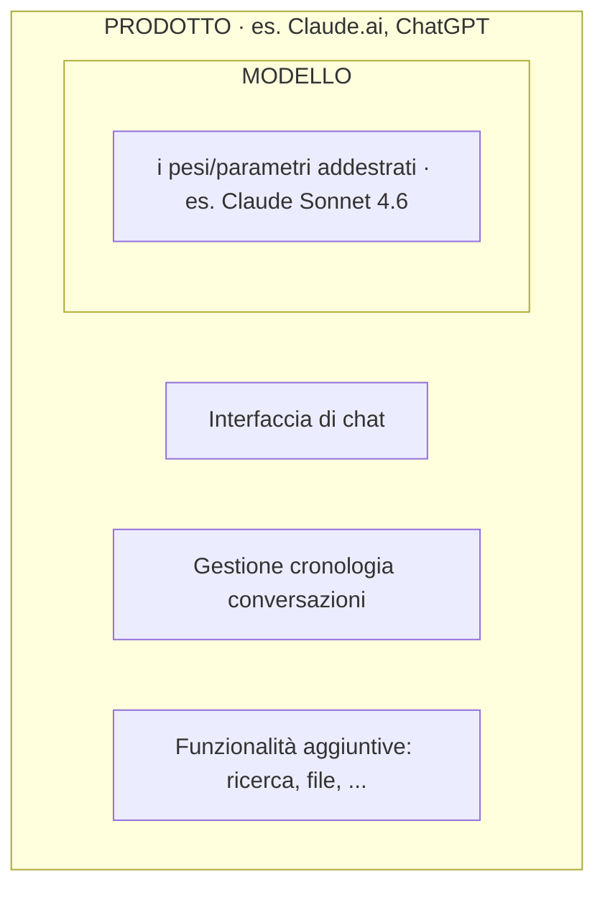

# Cos'è un LLM: previsione del token successivo come intelligenza emergente

> 📌 **In breve** · ⏱ ~45 min · 🎯 Capirai cosa fa *davvero* un modello come ChatGPT o Claude.
> Prevede la parola successiva, una alla volta. Da questa idea semplice nasce tutto: token, parametri, e la differenza tra “modello” e “prodotto”.

> **Quick Recap — da dove arriviamo**
>
> Nei capitoli precedenti abbiamo costruito la comprensione pezzo per pezzo: le reti neurali come sistemi che apprendono dai dati (Cap. 3), il deep learning come architettura a strati che estrae rappresentazioni via via più astratte, la backpropagation come meccanismo di apprendimento che aggiusta i pesi sulla base degli errori. Abbiamo visto come il Transformer ha risolto il problema di rappresentare il linguaggio in modo efficiente e scalabile — aprendo la strada a modelli addestrati su quantità di testo senza precedenti. Il linguaggio, in tutto questo percorso, è emerso come il dominio ideale su cui applicare questa architettura: ricco, strutturato, e disponibile in quantità enorme su Internet.
>
> **Una distinzione fondamentale prima di procedere:** il modello che stai per conoscere è il modello BASE — quello che prevede il token successivo, addestrato su grandi quantità di testo grezzo. Quello che usi in Claude.ai o ChatGPT è già stato ulteriormente addestrato tramite RLHF (Reinforcement Learning from Human Feedback — lo vedremo in 04-02) per diventare un assistente utile, sicuro, e allineato alle preferenze umane. Sono cose diverse, e confonderle porta a incomprensioni importanti su come funzionano davvero questi sistemi.

In questo capitolo arriveremo finalmente al cuore della materia: capire cosa sono davvero i modelli linguistici di grandi dimensioni, come funzionano internamente e perché producono output così sorprendenti. È il punto di convergenza di tutto ciò che abbiamo studiato finora, e la base tecnica imprescindibile per costruire sistemi AI competenti.

## Introduzione

Siamo arrivati al momento in cui tutto il Capitolo 3 converge in una risposta precisa. Abbiamo visto le reti neurali (3.3), il problema di rappresentare il linguaggio con numeri (3.4), e l'architettura Transformer che risolve quel problema in modo scalabile (3.5). Un **LLM** — Large Language Model, modello linguistico di grandi dimensioni — è, in termini essenziali, un'architettura Transformer (tipicamente solo-decoder, come visto nella lezione precedente) addestrata su quantità di testo straordinariamente grandi, con un numero di parametri che si misura in miliardi.

Questa lezione ha un obiettivo che va oltre la definizione tecnica: vuole costruire in te un modello mentale **corretto e resistente alle esagerazioni** di cosa sia davvero un LLM. Capire con precisione che un LLM è, alla base, un sistema che prevede il token successivo — e capire come da questo compito apparentemente meccanico emergano capacità sorprendenti — è la base di ogni decisione progettuale che prenderemo costruendo agenti, dal Capitolo 6 in poi.

---

## Obiettivi di Apprendimento

Al termine di questa lezione sarai in grado di:

- Definire un LLM nei termini tecnici corretti: un sistema addestrato a prevedere il token successivo
- Spiegare cosa è un token e perché non coincide né con una lettera né con una parola
- Capire perché capacità complesse possono emergere da un compito apparentemente semplice
- Distinguere con precisione un modello (es. Claude Sonnet 4.6) da un prodotto che lo utilizza (es. Claude.ai)

---

## 1. La definizione tecnica: prevedere il token successivo

Spogliato di ogni mistificazione, un LLM esegue, alla sua base, un compito sorprendentemente semplice da descrivere:

> Dato un testo (il contesto), prevedere quale sia il **prossimo elemento** più probabile che segue.

```
Contesto:  "Il gatto è salito sul"

Il modello calcola una probabilità per OGNI possibile
elemento successivo nel suo vocabolario:

"tetto"     → probabilità: 0.31
"divano"    → probabilità: 0.24
"albero"    → probabilità: 0.18
"tavolo"    → probabilità: 0.09
"elefante"  → probabilità: 0.0001
...
```

Il modello, dopo aver calcolato queste probabilità per ogni possibile elemento del suo vocabolario, ne seleziona uno (con meccanismi che vedremo nella Lezione 4.4 a proposito della "temperature"), lo aggiunge al testo, e ripete l'intero processo da capo per generare l'elemento successivo, e poi il successivo ancora — fino a costruire, parola per parola (più precisamente, token per token), un'intera risposta.

Questo è, letteralmente, tutto quello che un LLM fa al livello più fondamentale. Non c'è un modulo separato per "comprendere", un altro per "ragionare", un altro per "decidere cosa è vero": c'è un singolo meccanismo, ripetuto milioni di volte, che prevede l'elemento successivo più probabile dato tutto il contesto fino a quel momento.

---

## 2. Cosa sono i token: né lettere, né parole

Abbiamo usato la parola "elemento" sopra invece di "parola" deliberatamente. Il vero elemento che un LLM manipola si chiama **token**, ed è importante capire con precisione cosa sia, perché non corrisponde esattamente né a una singola lettera né a una parola intera.

Un token è un'unità di testo, determinata da un processo chiamato **tokenizzazione**, che spezza il testo in pezzi che possono essere:

- Parole intere comuni ("gatto", "il", "casa")
- Pezzi di parole più lunghe o rare ("anti", "costituzional", "issimo" — frammenti che, combinati, formano "anticostituzionalissimo")
- Singoli caratteri, per simboli rari o sequenze non viste durante l'addestramento
- Spazi, punteggiatura, e altri caratteri speciali, spesso uniti alla parola successiva

```
Testo:  "L'intelligenza artificiale è straordinaria"

Possibile tokenizzazione (semplificata, indicativa):
["L'", "intelligen", "za", " artificiale", " è", " straordinari", "a"]
```

> **Perché questa scelta progettuale:** usare frammenti di sottoparola, invece di parole intere, permette al modello di gestire elegantemente parole nuove, errori di battitura, parole composte, e lingue diverse, senza dover avere un vocabolario infinito che contenga ogni possibile parola esistente al mondo. Se il modello incontra una parola che non ha mai visto per intero, può comunque costruirla a partire da frammenti più piccoli e familiari.

Questo dettaglio tecnico ha conseguenze pratiche dirette e immediate: il **context window** di cui parleremo nella prossima lezione si misura in token, non in parole o caratteri; il costo delle chiamate API ai modelli linguistici si calcola tipicamente in base al numero di token elaborati; e capire approssimativamente quanti token occupa un testo (in inglese, una buona regola empirica è circa 4 caratteri per token; in italiano spesso leggermente meno, per via di parole più lunghe) è un'abilità pratica utile per chiunque lavori con questi sistemi.

---

## 3. Come da un compito semplice emergono capacità complesse

Ecco il punto concettualmente più sorprendente, e anche il più frainteso, di tutto l'argomento LLM: come può un sistema che fa "solo" prevedere il token successivo risolvere problemi di matematica, scrivere codice funzionante, ragionare su scenari ipotetici, o tradurre tra lingue?

La risposta sta nella scala e nella natura statistica del compito. Per essere davvero bravo a prevedere il token successivo su **qualsiasi** testo possibile — non solo frasi semplici, ma anche dimostrazioni matematiche, codice sorgente, dialoghi filosofici, articoli scientifici — un modello deve, implicitamente, sviluppare al suo interno rappresentazioni che catturano:

- Relazioni grammaticali e sintattiche
- Fatti sul mondo (per prevedere correttamente "la capitale della Francia è ___", il modello deve aver "assorbito" questa informazione dai dati)
- Schemi logici e matematici (per completare correttamente una dimostrazione o un calcolo)
- Strutture di codice e logica di programmazione

> **Analogia concreta:** immagina un essere umano che leggesse letteralmente ogni libro, articolo, sito web, codice sorgente pubblicamente disponibile su Internet, e che venisse allenato — ripetutamente, per anni — esclusivamente sul gioco "indovina la prossima parola". Per diventare davvero bravo in questo gioco su una varietà così estrema di testi, questa persona dovrebbe necessariamente sviluppare una comprensione profonda di grammatica, fatti, logica, stile — non perché qualcuno gliel'abbia insegnato direttamente, ma perché è l'unico modo per eccellere nel compito assegnato.

Questo fenomeno — capacità sofisticate che emergono come sottoprodotto necessario di un obiettivo di addestramento semplice, quando applicato su scala sufficientemente grande — si chiama spesso **emergenza**, e resta uno degli aspetti più studiati e meno completamente compresi degli LLM moderni.

### Una cautela importante

È fondamentale non scambiare questa emergenza per comprensione nel senso umano, né per garanzia di correttezza. Un modello che prevede statisticamente il token successivo più probabile può produrre testo grammaticalmente perfetto e stilisticamente convincente che è, nei fatti, sbagliato — perché il suo obiettivo di addestramento è "cosa è statisticamente plausibile dato il contesto", non "cosa è vero". Questa distinzione sarà al centro della Lezione 4.5, quando parleremo delle allucinazioni.

---

## 4. I parametri: cosa significano i "miliardi"

Nella Lezione 3.3 abbiamo definito i pesi come i numeri regolabili di una rete neurale, aggiustati durante l'addestramento tramite backpropagation. Quando si parla di un LLM con "70 miliardi di parametri" o "un trilione di parametri", ci si riferisce esattamente a questo: il numero totale di pesi regolabili distribuiti in tutti gli strati dell'architettura Transformer che compone il modello.

Più parametri significano, in generale (anche se non in modo strettamente lineare né garantito), una maggiore capacità del modello di catturare pattern complessi e sottili nei dati di addestramento — ma comportano anche costi computazionali proporzionalmente più alti, sia per l'addestramento sia per l'utilizzo (l'inferenza, cioè il momento in cui il modello genera effettivamente una risposta).

Non esiste un numero "giusto" di parametri in assoluto: i laboratori di ricerca bilanciano costantemente dimensione del modello, quantità di dati di addestramento disponibili, e budget computazionale, in una ricerca di efficienza che è essa stessa un campo di studio attivo.

---

## 5. La differenza tra modello e prodotto

Un'ultima distinzione, essenziale per evitare confusioni che si ripercuoteranno su tutto il resto del corso: **un modello non è la stessa cosa di un prodotto che lo utilizza**.

- **Claude Sonnet 4.6** è un modello: un insieme di pesi (parametri) addestrati, accessibile tecnicamente tramite API (esattamente come visto nella Lezione 1.5)
- **Claude.ai** è un prodotto: un'applicazione web (una Web Application, secondo la definizione della Lezione 1.4) che usa quel modello come componente, aggiungendo un'interfaccia di chat, gestione della cronologia, funzionalità di ricerca, e molto altro



Questa distinzione è esattamente quella che ci permetterà, dal Capitolo 5 in poi, di costruire **i nostri stessi prodotti** attorno al modello: il modello resta lo stesso (lo stesso insieme di parametri accessibile via API), ma noi costruiremo attorno a esso strumenti, memoria, logica di orchestrazione — esattamente come Anthropic ha costruito Claude.ai attorno al modello Claude.

---

## Esempio Pratico: Stimare i Token di un Testo

Prendi una frase qualsiasi, ad esempio: "L'intelligenza artificiale sta trasformando il modo in cui lavoriamo."

Usando la regola empirica approssimativa di circa 4 caratteri per token (valida soprattutto per l'inglese, leggermente meno precisa per l'italiano), questa frase di circa 75 caratteri occuperebbe grossolanamente 18-20 token. Questo tipo di stima rapida è un'abilità pratica che userai costantemente quando, nel Capitolo 5, dovrai ragionare su quanto testo "entra" nel context window di un modello, o su quanto costerà, in termini di token elaborati, una determinata chiamata API.

Molti provider (incluso Anthropic) offrono strumenti online per contare esattamente i token di un testo specifico: vale la pena, quando inizierai a costruire sistemi reali, familiarizzare con questi strumenti per sviluppare un'intuizione precisa.

---

## Riepilogo

- Un **LLM**, alla sua base tecnica, prevede il **token successivo** più probabile dato un contesto, ripetendo questo processo per generare testo via via più lungo.
- Un **token** è un'unità di testo (spesso un frammento di parola), determinata da un processo di tokenizzazione, né lettera né parola intera.
- Capacità complesse (ragionamento, conoscenza fattuale, scrittura di codice) **emergono** dal compito apparentemente semplice di prevedere il token successivo, quando applicato su scala enorme — ma questo non equivale a comprensione né garantisce correttezza.
- I **parametri** di un LLM sono i pesi della sua architettura Transformer, il cui numero (spesso miliardi) influenza la capacità del modello di catturare pattern complessi.
- Un **modello** (es. Claude Sonnet 4.6) è distinto da un **prodotto** che lo utilizza (es. Claude.ai): il modello è accessibile via API ed è il componente centrale attorno a cui si costruiscono prodotti e, come vedremo, agenti.

---

## Domande di Verifica

1. Se un LLM "prevede solo il token successivo", come spieghi il fatto che riesca a mantenere coerenza logica su un intero paragrafo o persino su un documento lungo? Cosa deve necessariamente "tenere in conto" a ogni singola previsione?

2. Perché la tokenizzazione a livello di sottoparola (invece che a livello di parola intera) rende un modello più robusto nel gestire parole nuove o errori di battitura?

3. Spiega, con parole tue, perché "il modello produce testo statisticamente plausibile" non è la stessa cosa di "il modello produce testo vero". Quali conseguenze pratiche ha questa distinzione per chi usa un LLM in un contesto professionale?

---

## Esercizi Pratici

> Tre esercizi a difficoltà crescente. Prova a risolverli da solo prima di aprire la soluzione.

### Esercizio 1 — Token, non parole 🟢 Base

Spiega perché un token non è né una lettera né una parola. Poi stima (con la regola ~4 caratteri/token) quanti token occupa circa la frase: "Gli agenti AI useranno strumenti esterni" (~40 caratteri).

<details>
<summary>💡 Mostra soluzione</summary>

**Cos'è un token:** un'unità di testo prodotta dalla tokenizzazione. Può essere una parola intera comune ("casa"), un **frammento** di parola lunga/rara ("anti", "issimo"), un singolo carattere, o punteggiatura/spazi. Sta "in mezzo" tra lettera e parola: più grande di una lettera, spesso più piccolo di una parola intera.

**Stima:** ~40 caratteri ÷ 4 ≈ **10 token** (stima grossolana; in italiano spesso un po' di più per via delle parole lunghe).

Perché conta: context window e costo delle API si misurano in **token**, non in parole. Saper stimare i token è un'abilità pratica.

</details>

### Esercizio 2 — Modello o prodotto? 🟡 Intermedio

Classifica come **modello** o **prodotto**: (a) Claude Sonnet 4.6, (b) Claude.ai, (c) GPT-4, (d) ChatGPT. Poi: elenca almeno tre cose che il *prodotto* aggiunge attorno al modello.

<details>
<summary>💡 Mostra soluzione</summary>

- **(a) Claude Sonnet 4.6** → **modello** (insieme di pesi, accessibile via API).
- **(b) Claude.ai** → **prodotto** (web app che usa il modello).
- **(c) GPT-4** → **modello**.
- **(d) ChatGPT** → **prodotto**.

Cosa aggiunge il prodotto attorno al modello: interfaccia di chat, gestione della cronologia delle conversazioni, autenticazione/account, e funzionalità extra (ricerca web, caricamento file, generazione di immagini…). Il modello è il "motore"; il prodotto è l'auto costruita attorno.

Questa distinzione è ciò che ci permetterà, dal Capitolo 5, di costruire **i nostri** prodotti/agenti attorno allo stesso modello via API.

</details>

### Esercizio 3 — Coerenza e verità 🔴 Avanzato

Se un LLM "prevede solo il token successivo", come fa a restare coerente su un intero paragrafo? E perché "testo statisticamente plausibile" non è la stessa cosa di "testo vero"? Che conseguenza pratica ha per chi lo usa al lavoro?

<details>
<summary>💡 Mostra soluzione</summary>

**Coerenza:** a ogni previsione il modello considera **tutto il contesto fino a quel punto** (grazie all'attention, Lezione 3.5), inclusi i token che ha appena generato. Ogni nuovo token diventa contesto per il successivo. Così la "coerenza" emerge: ogni passo è condizionato da tutto ciò che precede, non è una catena di scelte indipendenti.

**Plausibile ≠ vero:** l'obiettivo di addestramento è "qual è il token più probabile dato il contesto", **non** "qual è la verità". Un'affermazione falsa può essere statisticamente molto plausibile (suona giusta, è grammaticale, assomiglia a frasi viste nei dati). Il modello non ha un modulo di verifica della verità.

**Conseguenza pratica:** mai fidarsi ciecamente di un output, specie su fatti, numeri, citazioni. Servono verifica, fonti (RAG, Lezione 5.3), strumenti per i calcoli (Function Calling, Lezione 5.4) e supervisione. È la radice delle allucinazioni (Lezione 4.5).

</details>

---

## 🧪 Visualizza un LLM in Azione

**Tokenizer interattivo**: vai su platform.openai.com/tokenizer (o cerca "tokenizer visualizer" online). Incolla questa frase:
> "Intelligenza artificiale applicata alla scuola italiana"

Osserva: quanti token sono? Corrispondono alle parole? Perché "artificiale" potrebbe essere spezzato in più token?

**Perché è utile**: capire il tokenizer ti fa capire COME un LLM "vede" il tuo testo — e perché certi prompt costano di più di altri.

---

## Connessioni

**Viene da:** Lezione 3.5 — il Transformer descritto lì è esattamente l'architettura che, addestrata su scala enorme, costituisce un LLM.

**Porta a:** Lezione 4.2 (Training, Fine-tuning e RLHF) — vedremo esattamente come, concretamente, un LLM viene addestrato a diventare un assistente utile, partendo dal compito grezzo di previsione del token successivo.

**Ritroverai questi concetti in:** Lezione 4.5 (Limiti e allucinazioni) — la distinzione tra plausibilità statistica e verità, introdotta qui, sarà il fondamento per capire perché e come un LLM allucina. Lezione 5.1 (L'API degli LLM) — vedremo concretamente come si invia una richiesta a un modello come quello descritto in questa lezione, riusando esattamente la struttura di richiesta/risposta API vista nella Lezione 1.5.
