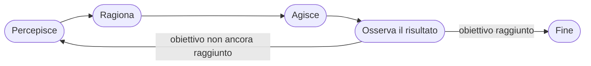
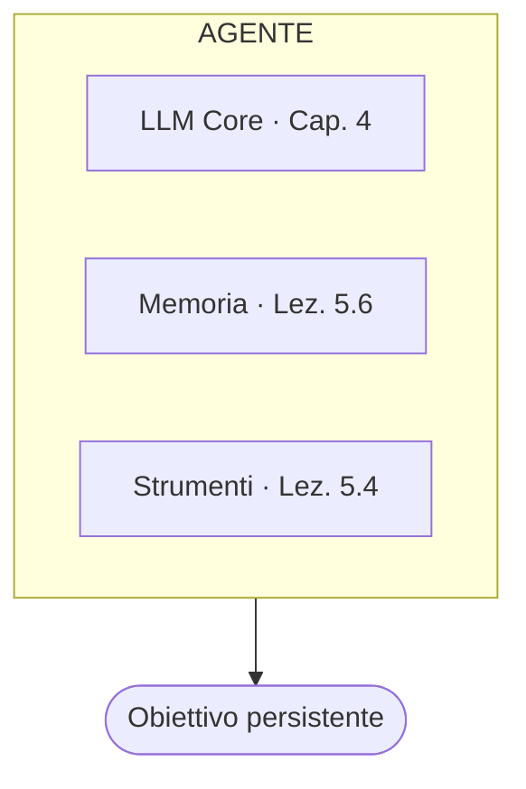

# Cos'è un Agente AI: definizione, componenti e loop agentivo

> 📌 **In breve** · ⏱ ~50 min · 🎯 Capirai cos’è un agente AI e perché è il traguardo del corso.
> Non è un LLM più potente: è un sistema con un ciclo osserva → pensa → agisci. Qui si assembla tutto ciò che hai costruito finora.

> **⚡ Setup richiesto**: il Capitolo 6 usa le stesse librerie del Capitolo 5. Se non le hai ancora installate:
> ```bash
> pip install anthropic python-dotenv pydantic
> ```
> Per le lezioni con LangGraph (Cap. 6.3 in poi): `pip install langgraph`

In questo capitolo assembliamo tutto ciò che abbiamo costruito in un'unica architettura funzionante: l'agente AI. Vedremo come strutturare un sistema che percepisce, ragiona e agisce in modo autonomo — e impareremo a farlo con rigore ingegneristico, non come esperimento, ma come sistema progettato per durare.

## Introduzione

Siamo arrivati al momento per cui tutto il corso si è preparato. Nel Capitolo 5 abbiamo costruito, uno per uno, ogni componente necessario: la chiamata a un modello (5.1), output che il programma può usare con fiducia (5.2), accesso a informazioni esterne (5.3), capacità di eseguire azioni reali (5.4), standardizzazione delle connessioni (5.5), e gestione della memoria (5.6). Questa lezione li assembla, per la prima volta, in un **agente**.

È importante affrontare questa lezione senza eccessiva soggezione verso la parola "agente" — un termine usato spesso con un'aura di mistero che non gli appartiene. Vedremo che un agente è precisamente la combinazione, organizzata secondo un pattern preciso e ripetibile, di componenti che già conosci. Niente di magico: solo un'architettura specifica, con un nome specifico, perché risolve un problema specifico.

---

## Obiettivi di Apprendimento

Al termine di questa lezione sarai in grado di:

- Dare una definizione operativa e precisa di agente AI, priva di vaghezza
- Identificare i quattro componenti di un agente in un sistema reale
- Implementare un loop agentivo minimo, completo e funzionante
- Distinguere un sistema reattivo da un sistema agentivo con esempi concreti

---

## 1. Definizione operativa: percepisce, ragiona, agisce, osserva

Un **agente AI** è un sistema che, per raggiungere un obiettivo, esegue ripetutamente un ciclo di quattro fasi:



- **Percepisce**: riceve informazioni sullo stato attuale — la richiesta dell'utente, il risultato di un'azione precedente, dati recuperati da uno strumento
- **Ragiona**: usando il modello linguistico (Capitolo 4), decide cosa fare, basandosi su ciò che ha percepito e sull'obiettivo da raggiungere
- **Agisce**: esegue effettivamente qualcosa — tipicamente tramite il Function Calling visto nella Lezione 5.4 — che modifica lo stato del mondo o recupera nuova informazione
- **Osserva il risultato**: percepisce l'effetto della propria azione, e usa questa nuova informazione per decidere il passo successivo

La caratteristica che distingue radicalmente un agente da una singola chiamata API (come quelle viste nella Lezione 5.1) è precisamente questo: **il ciclo si ripete**, un numero di volte non necessariamente prevedibile in anticipo, fino a quando l'obiettivo è stato raggiunto o si decide di interrompere il processo.

> **Perché questo richiede memoria (Lezione 5.6):** ogni iterazione del ciclo deve "ricordare" cosa è successo nelle iterazioni precedenti, altrimenti l'agente ripeterebbe all'infinito le stesse azioni, incapace di fare progressi. La memoria in-context, descritta nella lezione precedente, è precisamente il meccanismo che rende possibile questa continuità.

---

## 2. I quattro componenti di un agente

Scomponiamo la definizione operativa in componenti tecnici concreti, ciascuno dei quali corrisponde direttamente a qualcosa già costruito nel Capitolo 5:



Nessuno di questi quattro componenti è nuovo: li hai già costruiti, separatamente, nelle lezioni precedenti. Ciò che rende il sistema un "agente" è **l'organizzazione** di questi componenti secondo il loop descritto nella Sezione 1, con un obiettivo che persiste attraverso multiple iterazioni.

---

## 3. Sistema reattivo vs sistema agentivo: la differenza che conta davvero

È utile, a questo punto, tracciare un confine preciso tra due categorie di sistemi che useremo costantemente nel resto del corso.

```
SISTEMA REATTIVO                       SISTEMA AGENTIVO

Riceve un input                        Riceve un obiettivo
       │                                       │
       ▼                                       ▼
Produce UNA risposta                   Esegue MULTIPLI passi,
       │                                decidendo autonomamente
       ▼                                quanti e quali, finché
       FINE                            l'obiettivo non è
                                        raggiunto (o si rinuncia)
                                               │
                                               ▼
                                              FINE

Esempio: la funzione                   Esempio: un sistema che,
chiedi_a_claude() della                dato "prenota un viaggio
Lezione 5.1 — una                      a Roma per il weekend",
domanda, una risposta,                 cerca voli, confronta prezzi,
nessuna iterazione                     verifica disponibilità
                                        hotel, e propone un'opzione
                                        completa — un numero di
                                        passi non fissato in anticipo
```

Tutto ciò che abbiamo costruito nel Capitolo 5 — inclusa la singola chiamata con Function Calling della Lezione 5.4 — era, tecnicamente, ancora un sistema reattivo: una domanda, eventualmente uno strumento usato una volta, una risposta. Un **agente**, nel senso pieno che useremo da questa lezione in avanti, è un sistema che può eseguire **una sequenza non predeterminata di passi**, decidendo autonomamente, a ogni iterazione, se ha bisogno di fare qualcos'altro prima di poter rispondere.

---

## 4. Implementazione pratica: un loop agentivo minimo

Vediamo ora, concretamente, come si implementa il ciclo descritto nella Sezione 1, estendendo direttamente il codice di Function Calling costruito nella Lezione 5.4. La differenza chiave rispetto a quel codice: invece di gestire **una singola** possibile chiamata di strumento, costruiamo un **ciclo** che continua fino a quando il modello decide di non aver più bisogno di strumenti.

```python
import anthropic
import json

def cerca_sul_web(query: str) -> dict:
    """Strumento di esempio (implementazione reale omessa)."""
    return {"risultati": f"Informazioni trovate su: {query}"}

def calcola(espressione: str) -> dict:
    """Strumento di esempio per calcoli precisi."""
    try:
        return {"risultato": eval(espressione)}
    except Exception as e:
        return {"errore": str(e)}

STRUMENTI_DISPONIBILI = {
    "cerca_sul_web": cerca_sul_web,
    "calcola": calcola,
}

DEFINIZIONI_STRUMENTI = [
    {
        "name": "cerca_sul_web",
        "description": "Cerca informazioni aggiornate sul web.",
        "input_schema": {
            "type": "object",
            "properties": {"query": {"type": "string"}},
            "required": ["query"]
        }
    },
    {
        "name": "calcola",
        "description": "Esegue un calcolo matematico preciso.",
        "input_schema": {
            "type": "object",
            "properties": {"espressione": {"type": "string"}},
            "required": ["espressione"]
        }
    }
]


def esegui_agente(obiettivo: str, max_iterazioni: int = 5) -> str:
    """
    Il LOOP AGENTIVO: ripete Observe-Think-Act finché il modello
    non produce una risposta finale, o si raggiunge il limite
    di sicurezza max_iterazioni.
    """
    client = anthropic.Anthropic()

    # MEMORIA: la cronologia che si accumula a ogni iterazione
    messaggi = [{"role": "user", "content": obiettivo}]

    for iterazione in range(max_iterazioni):

        # RAGIONA: il modello decide il prossimo passo
        risposta = client.messages.create(
            model="claude-sonnet-4-6",
            max_tokens=1024,
            tools=DEFINIZIONI_STRUMENTI,
            messages=messaggi
        )

        messaggi.append({"role": "assistant", "content": risposta.content})

        # Se il modello non richiede strumenti, ha finito: AGISCE
        # restituendo direttamente la risposta finale
        if risposta.stop_reason != "tool_use":
            return risposta.content[0].text

        # AGISCE: esegue gli strumenti richiesti dal modello
        risultati_strumenti = []
        for blocco in risposta.content:
            if blocco.type == "tool_use":
                funzione = STRUMENTI_DISPONIBILI[blocco.name]
                risultato = funzione(**blocco.input)

                # OSSERVA: il risultato diventa parte della memoria,
                # disponibile per la prossima iterazione del ciclo
                risultati_strumenti.append({
                    "type": "tool_result",
                    "tool_use_id": blocco.id,
                    "content": json.dumps(risultato)
                })

        messaggi.append({"role": "user", "content": risultati_strumenti})

    return "Limite di iterazioni raggiunto senza una risposta finale."


# Utilizzo:
risultato = esegui_agente(
    "Quanto fa 47 al quadrato, e poi cerca informazioni sul "
    "numero risultante se è un numero significativo in qualche contesto?"
)
print(risultato)
```

Osserva con attenzione la struttura del `for`: a ogni iterazione, la lista `messaggi` cresce, accumulando sia le richieste di strumenti del modello sia i risultati ottenuti — è la **memoria in-context** della Lezione 5.6 applicata esplicitamente al contesto di un agente. Il ciclo termina naturalmente quando il modello, avendo ricevuto abbastanza informazioni, decide di non richiedere più strumenti e produce una risposta finale.

### Perché esiste `max_iterazioni`

Nota il parametro `max_iterazioni`, con un valore predefinito di sicurezza. Senza questo limite, un agente che entrasse in un ciclo problematico (ad esempio, richiedendo ripetutamente lo stesso strumento senza mai arrivare a una conclusione) continuerebbe a eseguire chiamate API all'infinito, con costi crescenti senza controllo. Questo è un primo, semplice esempio di un tema che approfondiremo con rigore nella Lezione 6.5: la robustezza di un agente richiede meccanismi espliciti di protezione contro comportamenti imprevisti.

---

## 5. Esempi concreti di agenti

Per consolidare la definizione, alcuni esempi di agenti reali, descritti in termini dei componenti visti in questa lezione:

- **Un agente di ricerca**: obiettivo = rispondere a una domanda complessa; strumenti = motore di ricerca web, lettore di pagine; memoria = i risultati di ricerca già consultati nel ciclo corrente; il loop continua finché non ha raccolto informazioni sufficienti per una risposta completa
- **Un agente di codice** (come quello dietro strumenti di sviluppo assistito): obiettivo = risolvere un problema di programmazione; strumenti = lettura/scrittura di file, esecuzione di codice, ricerca nella documentazione; il loop continua attraverso tentativi, errori, e correzioni, fino a un risultato funzionante
- **Un agente di customer service**: obiettivo = risolvere la richiesta di un cliente; strumenti = accesso al database ordini, sistema di rimborsi, knowledge base aziendale (RAG, Lezione 5.3); il loop continua raccogliendo informazioni necessarie prima di poter fornire una risposta o eseguire un'azione risolutiva

---

## Esempio Pratico: Tracciare un'Esecuzione Passo per Passo

Seguiamo concettualmente cosa accadrebbe eseguendo `esegui_agente("Quanto fa 47 al quadrato, e poi cerca informazioni...")` con il codice della Sezione 4:

```
ITERAZIONE 1:
  RAGIONA: il modello vede l'obiettivo, decide di usare
           lo strumento "calcola" con espressione "47**2"
  AGISCE:  il programma esegue calcola("47**2") → {"risultato": 2209}
  OSSERVA: il risultato (2209) viene aggiunto alla memoria

ITERAZIONE 2:
  RAGIONA: il modello vede che ora conosce il risultato (2209),
           decide di usare "cerca_sul_web" con query "2209"
  AGISCE:  il programma esegue cerca_sul_web("2209") →
           {"risultati": "Informazioni trovate su: 2209"}
  OSSERVA: il risultato della ricerca viene aggiunto alla memoria

ITERAZIONE 3:
  RAGIONA: il modello ha ora sia il calcolo sia i risultati
           della ricerca; decide che ha informazioni sufficienti
  → stop_reason NON è più "tool_use"
  → restituisce la risposta finale, basata su entrambi i risultati
```

Questa traccia rende tangibile cosa significa, in pratica, "un numero non predeterminato di passi": il programmatore non ha scritto "prima calcola, poi cerca" — è stato il **modello stesso**, nel ruolo di "ragiona" del ciclo, a decidere autonomamente questa sequenza, basandosi sulla descrizione degli strumenti disponibili e sull'obiettivo fornito.

---

## Riepilogo

- Un **agente AI** è un sistema che esegue ripetutamente un ciclo **percepisce → ragiona → agisce → osserva**, fino al raggiungimento di un obiettivo o a un limite di sicurezza.
- I quattro componenti di un agente — **LLM core**, **memoria**, **strumenti**, **obiettivo** — corrispondono direttamente a concetti già costruiti nel Capitolo 5: nessun componente è nuovo, è nuova l'organizzazione.
- Un **sistema reattivo** produce una risposta per un input; un **sistema agentivo** esegue un numero di passi non predeterminato, deciso autonomamente in base al progresso verso l'obiettivo.
- Il **loop agentivo minimo** si implementa estendendo il Function Calling della Lezione 5.4 con un ciclo che accumula memoria a ogni iterazione, terminando quando il modello non richiede più strumenti.
- Un limite massimo di iterazioni (`max_iterazioni`) è un primo, essenziale meccanismo di sicurezza contro comportamenti imprevisti — tema che approfondiremo nella Lezione 6.5.

---

## Domande di Verifica

1. Nel codice della Sezione 4, identifica esattamente la riga (o le righe) che corrispondono a ciascuna delle quattro fasi del loop agentivo: percepisce, ragiona, agisce, osserva.

2. Perché un sistema reattivo come la funzione `chiedi_a_claude()` della Lezione 5.1, anche se arricchita con Function Calling come nella Lezione 5.4, non sarebbe ancora sufficiente per un compito come "pianifica un viaggio di una settimana, confrontando prezzi di voli e hotel da più fonti"?

3. Immagina di rimuovere completamente il parametro `max_iterazioni` dal codice della Sezione 4. Descrivi un possibile scenario, anche ipotetico, in cui questa assenza causerebbe un problema concreto.

---

## Esercizi Pratici

> Tre esercizi a difficoltà crescente. Prova a risolverli da solo prima di aprire la soluzione.

### Esercizio 1 — Le fasi e i componenti 🟢 Base

Elenca le quattro fasi del loop agentivo e i quattro componenti di un agente. Per ciascun componente, indica in quale lezione del Capitolo 5 era stato costruito.

<details>
<summary>💡 Mostra soluzione</summary>

**Le quattro fasi del loop:** Percepisce → Ragiona → Agisce → Osserva il risultato (e ricomincia).

**I quattro componenti:**
- **LLM core** (il motore di ragionamento) → Capitolo 4.
- **Memoria** (cosa ricorda dai passi precedenti) → Lezione 5.6.
- **Strumenti** (cosa può fare nel mondo) → Lezione 5.4.
- **Obiettivo** (cosa cerca di raggiungere).

Punto chiave: nessun componente è nuovo. Ciò che rende il sistema un *agente* è l'**organizzazione** di questi pezzi nel loop, con un obiettivo che persiste su più iterazioni.

</details>

### Esercizio 2 — Reattivo o agentivo? 🟡 Intermedio

Classifica come **reattivo** o **agentivo**: (a) tradurre una frase, (b) "pianifica un viaggio confrontando voli e hotel da più fonti", (c) rispondere a "che ore sono?", (d) "trova il bug in questo codice, correggilo e verifica che i test passino". Perché una singola chiamata API non basta per (b) e (d)?

<details>
<summary>💡 Mostra soluzione</summary>

- **(a) tradurre** → **reattivo**: un input, una risposta.
- **(b) pianifica viaggio** → **agentivo**: più passi non predeterminati (cerca voli, confronta, verifica hotel…).
- **(c) che ore sono** → **reattivo** (eventualmente con un singolo strumento).
- **(d) trova/correggi bug + test** → **agentivo**: ciclo di tentativi, errori e correzioni.

**Perché una sola chiamata non basta per (b) e (d):** il numero di passi non è noto in anticipo e ogni passo dipende dal **risultato** del precedente (l'esito di una ricerca, l'output dei test). Serve un loop che decide autonomamente quando ha finito — esattamente la differenza tra reattivo e agentivo.

</details>

### Esercizio 3 — Il ruolo di max_iterazioni 🔴 Avanzato

Nel loop agentivo della lezione, cosa succederebbe rimuovendo `max_iterazioni`? Descrivi uno scenario concreto in cui causerebbe un problema. Perché è un meccanismo di sicurezza e non solo un dettaglio?

<details>
<summary>💡 Mostra soluzione</summary>

Senza `max_iterazioni`, se l'agente entra in un **ciclo senza progresso** continuerebbe a fare chiamate API **all'infinito**.

Scenario concreto: uno strumento restituisce sempre un errore che il modello non riesce a diagnosticare. A ogni iterazione il modello "riprova" lo stesso strumento, l'errore si ripresenta, e il loop non termina mai → costi crescenti senza limite e nessuna risposta.

**Perché è sicurezza:** `max_iterazioni` garantisce una **terminazione** anche nel caso peggiore, indipendentemente dal comportamento del modello. È la prima, semplice linea di difesa contro loop e comportamenti imprevisti — la Lezione 6.5 aggiungerà strategie più intelligenti (rilevare il loop *prima* del limite). Negli agenti, ogni meccanismo che garantisce terminazione e contenimento dei costi è una scelta di robustezza, non un dettaglio.

</details>

---

## Connessioni

**Viene da:** L'intero Capitolo 5 — questa lezione assembla, per la prima volta, tutti i componenti infrastrutturali costruiti separatamente (API, output strutturati, RAG, Function Calling, MCP, memoria) in un singolo sistema funzionante.

**Porta a:** Lezione 6.2 (ReAct e Chain-of-Thought) — vedremo come rendere più esplicito e affidabile il "ragiona" del ciclo, facendo sì che il modello esponga il proprio ragionamento prima di agire.

**Ritroverai questi concetti in:** Lezione 6.5 (Gestione degli Errori) — il limite `max_iterazioni` qui introdotto come precauzione semplice diventerà parte di una strategia di robustezza molto più articolata. Lezione 7.2 (L'Agent Package) — i quattro componenti descritti in questa lezione (LLM core, memoria, strumenti, obiettivo) diventeranno cartelle e file espliciti in un agente professionale strutturato.
